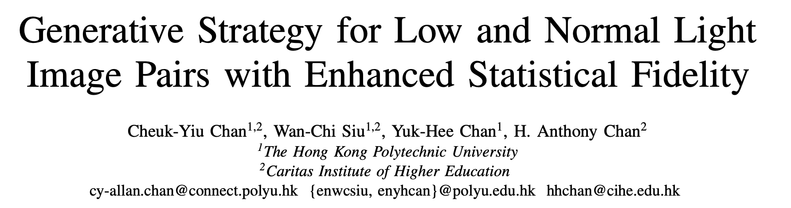
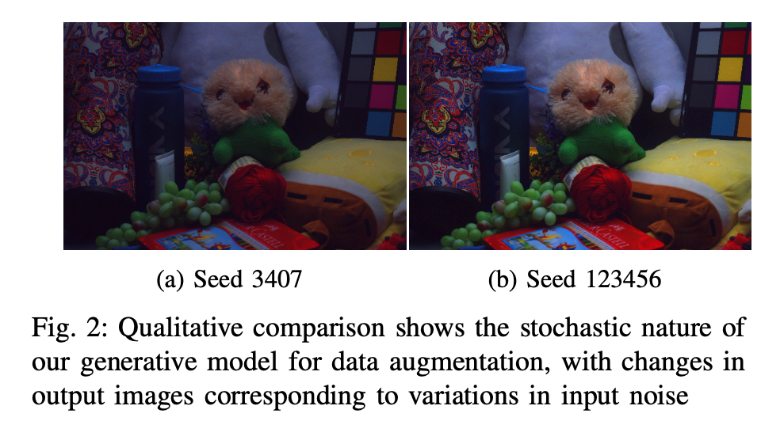
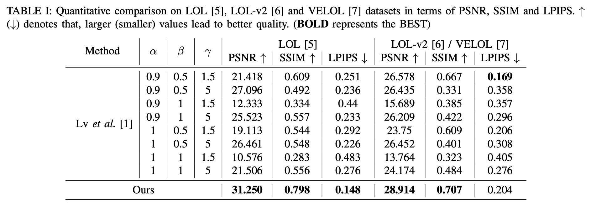
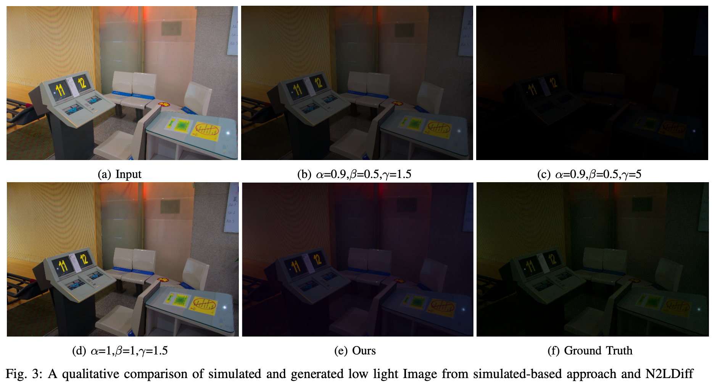
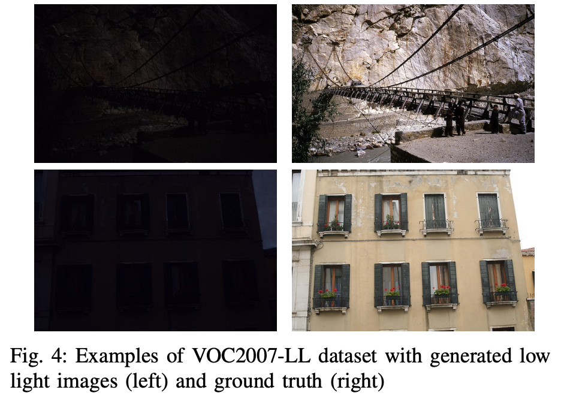

# Generative Strategy for Low and Normal Light Image Pairs with Enhanced Statistical Fidelity
by C-Y Chan, W-C Siu, Y-H Chan and H. A Chan


# Abstract
Low light image enhancement remains challenging due to limited availability of real low/normal light image pairs for training. Simple image simulation techniques used for data augmentation fail to accurately model noise and distortions present in real low light photos. In this work, we propose N2LDiff, a novel generative model leveraging diffusion processes to synthesize realistic low light images from normal light counterparts. Our model leverages the noise modeling capabilities of diffusion processes to generate low light images with accurate noise, blurring, and color distortions. We make the following key contributions: (1) We develop a novel N2LDiff model that can generate varied low light images from the same normal light input via diffusion processes. (2) We introduce a new benchmark for low light image synthesis using existing datasets. (3) Leveraging N2LDiff, we construct a large-scale low light dataset. Our generated data will facilitate training and evaluation of deep learning models for low light enhancement tasks.


# Installation
To install the dependencies, run the following command:

```
git clone https://github.com/allanchan339/N2LDiff
conda env create --name N2L --file=environments.yaml
```

# Dataset
We use LOL, VELOL and LOL-v2 datasets for training and testing. You can download the datasets from the following links:

1. [LOL](https://drive.google.com/file/d/18bs_mAREhLipaM2qvhxs7u7ff2VSHet2/view?usp=sharing)

2. [VELOL](https://www.dropbox.com/s/vfft7a8d370gnh7/VE-LOL-L.zip?dl=0)

3. [LOL-v2](https://drive.google.com/file/d/1dzuLCk9_gE2bFF222n3-7GVUlSVHpMYC/view?usp=sharing)

and put them in the folder `data/` with the following hararchy:

```
data
- LOL
    - eval15
    - our485

- LOLv2
    - Real_captured
        - Test
        - Train

- VE-LOL-L
    - VE-LOL-L-Cap-Full
        - test
        - train 
```

In the training and testing, we only use the real captured images in the datasets.

# Training
### Optional - wandb
If you want to train the model with the support of wandb to monitor the training process, you can create a wandb account from [here](https://wandb.ai/). 
Else, you can modify the `cfg/train/from_scratch.yaml` file to remove the wandb support by setting `wandb: False`

## Commands
```
conda activate N2L
python train.py --cfg cfg/train/from_scratch.yaml
```

# Testing
## Trained Model
Trained model can be downloaded from [here](https://connectpolyu-my.sharepoint.com/:u:/g/personal/17067305d_connect_polyu_hk/EZGcB71gNDJAmJ_CEp4qr0oB81WhMLYXs3D6vCuxPBuc5w?e=4hF1eP)

The model should be placed in the folder `checkpoints/`.

## Commands
The testing results will be saved in the folder `results_scratch_XXX/`.

Three testing modes are provided:
1. Test on LOL dataset
```
conda activate N2L
python test.py --cfg cfg/test/test_diffusion_from_scratch_LOL.yaml
```

2. Test on VE-LOL dataset
```
conda activate N2L
python test.py --cfg cfg/test/test_diffusion_from_scratch_VELOL.yaml
```

3. Test on LOL-v2 dataset
```
conda activate N2L
python test.py --cfg cfg/test/test_diffusion_from_scratch_LOLv2.yaml
```

4. Test on unpaired dataset
To do so, the cfg file `test_diffusion_from_scratch_unpaired.yaml` should be configured as follows:
```
test_folder_unpaired: "WHERE THE FOLDER IS"
```
Then, run the following command:
```
conda activate N2L
python test_unpaired.py --cfg cfg/test/test_diffusion_from_scratch_unpaired.yaml
```
# Results



# Proposed Dataset - VOC2007-LL
We have proposed N2LDiff, a novel diffusion-based gen- erative model that accurately synthesizes realistic low light images. By modeling noise and distortions induced by low lighting, N2LDiff surpasses simulation techniques in capturing true low light image statistics. Our large-scale low light dataset VOC2007-LL, generated with N2LDiff, will advance deep learning for low light tasks. 

Here is the [download link](https://connectpolyu-my.sharepoint.com/:u:/g/personal/17067305d_connect_polyu_hk/EVQ47RzRzXxCqNF6pKkM93QBQ_ttMMLBY7zzjg90LilVQA?e=01Ssbw) of the VOC2007-LL dataset. The dataset is generated from the VOC2007 dataset.


Here is the corresponding normal light dataset VOC2007:
1. [trainval](http://host.robots.ox.ac.uk/pascal/VOC/voc2007/VOCtrainval_06-Nov-2007.tahttp://host.robots.ox.ac.uk/pascal/VOC/voc2007/VOCtrainval_06-Nov-2007.tar)

2. [test](http://host.robots.ox.ac.uk/pascal/VOC/voc2007/VOCtest_06-Nov-2007.tar)

# Citation
If you find the resource useful, please cite the following :- )
```
@INPROCEEDINGS{10444437,
  author={Chan, Cheuk-Yiu and Siu, Wan-Chi and Chan, Yuk-Hee and Chan, H. Anthony},
  booktitle={2024 IEEE International Conference on Consumer Electronics (ICCE)}, 
  title={Generative Strategy for Low and Normal Light Image Pairs with Enhanced Statistical Fidelity}, 
  year={2024},
  volume={},
  number={},
  pages={1-3},
  keywords={Training;Deep learning;Diffusion processes;Lighting;Distortion;Data models;Task analysis;Low Light Image Enhancement;Generative Model;Diffusion;Data Augmentation},
  doi={10.1109/ICCE59016.2024.10444437}}
```

# Contact
Thanks for your attention! If you have any suggestion or question, feel free to leave a message here or contact me via cy3chan@sfu.edu.hk.
